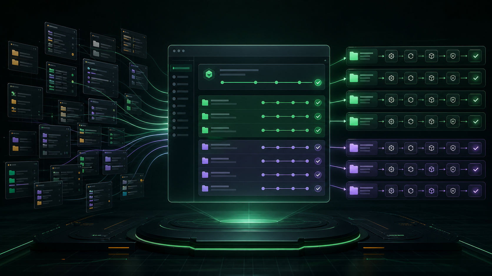
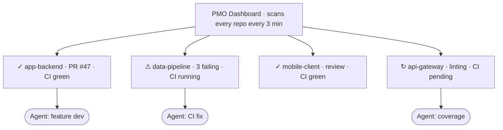

<div align="center">

# Agent PMO

### Stop Watching One Agent. Start Running Twenty.

<p>
  <a href="https://github.com/Nimblesite/AgentPMOWorkflow/blob/main/LICENSE"></a>
  <a href="https://nimblesite.github.io/AgentPMOWorkflow/"></a>
</p>

**🌐 Website:** [nimblesite.github.io/AgentPMOWorkflow](https://nimblesite.github.io/AgentPMOWorkflow/)





</div>

---

## The Problem

You've got an AI coding agent. It writes code, opens a PR, pushes to CI. CI fails. The agent goes back, fixes it, pushes again. You sit there watching — mentally tethered to one project, waiting for the green check before you can give the next instruction.

The agent is productive. **You're serialized.**

One project. One agent. One task at a time. Dead time between every step.

## The Solution

**Agent PMO is a Project Management Office where the staff are AI agents.**

The job isn't making one agent faster — it's making *you* capable of running dozens of projects simultaneously, with minimal cognitive load.

While one agent fights through CI, you've dispatched two others. You're not waiting. You're deciding what to review next.

---

## Two Components

### PMO Dashboard &nbsp;(`dashboard/`)

An F# script scans every repo under `~/Documents/Code/`, collects CI status, open PRs, uncommitted changes, and push status, then generates a self-contained HTML report refreshed every 3 minutes via launchd. You see everything at a glance. No context-switching into individual repos.

### Repo Standards Enforcement &nbsp;(`agent-pmo-skill/`)

A skill that applies portfolio-wide templates to any repo: same Makefile targets, same CI pipeline, same lint and format commands. Drop an agent into any standardized project and it already knows how to run, test, and ship — no setup, no babysitting. That's what makes twenty projects manageable instead of twenty separate headaches.

---

## Quality Gates

Agents don't hand you rough drafts. Lint, type check, format, unit tests, integration tests, and coverage thresholds are all enforced by CI with no soft-fail mode. Coverage thresholds are monotonically increasing — they never regress. By the time code reaches you, every automated check has passed. You're the final gate: reviewing intent and architecture, not whether it compiles.

---

## Why — Run the Data, Not the Hype

AI writes code faster than any team can review it. **Typing was never the bottleneck — verification is.** The research is blunt:

- **84%** of developers now use or plan to use AI coding tools ([Stack Overflow, 2025](https://survey.stackoverflow.co/2025/ai)) — yet trust in their output has *fallen* to **33%**, and the top frustration (45%) is "almost right, but not quite."
- Experienced developers were **19% slower** with AI on code they knew well — while *believing* they were 20% faster ([METR, 2025](https://metr.org/blog/2025-07-10-early-2025-ai-experienced-os-dev-study/)). You cannot manage AI by self-report.
- A **25% rise in AI adoption** tracked with a **7.2% drop in delivery stability** ([DORA, 2024](https://dora.dev/research/2024/dora-report/)). Big batches with weak verification are the oldest reliability risk in software.
- Duplicated code blocks rose **~8×** as AI adoption climbed ([GitClear, 2025](https://www.gitclear.com/ai_assistant_code_quality_2025_research)). More code you can't trust is a liability, not a return.
- Developers with an AI assistant wrote **less secure** code — and were *more* confident it was secure ([Stanford, ACM CCS 2023](https://arxiv.org/abs/2211.03622)). That is why every repo here gets CodeQL, secret scanning, dependency review, and a security policy **by default**.

**The fix is governance, not vibes.** Agent PMO is the verification-and-control layer the data demands: one dashboard over every agent, standardized quality gates, and security scanning on every PR. Spend to raise *quality* — never output volume.

**This repo is the playbook made executable.** Agent PMO implements the practices in Nimblesite's strategy guide, [How to Deploy AI in Your Engineering Team](https://www.nimblesite.co/ai-strategy/): drive from specs, gate on verification, run agents in parallel under review-altitude oversight, and put AI on defence. The guide is the *why*; this repo is the *how* — templates, quality gates, and a skill that make every repo conform.

---

## Get Started

The easiest way: clone the repo and run the setup target. `make setup` auto-detects your OS and runs the right script ([`setup/setup-macos-linux.sh`](setup/setup-macos-linux.sh) or [`setup/setup-windows.ps1`](setup/setup-windows.ps1)) — installing dependencies, generating the dashboard, and scheduling the 3-minute refresh.

```bash
git clone https://github.com/Nimblesite/AgentPMOWorkflow.git
cd AgentPMOWorkflow
make setup       # install dependencies + configure (auto-detects OS)
```

Then the standard targets:

```bash
make build       # generate the HTML dashboard
make test        # run full test suite
make ci          # lint + test + build
```

See [`docs/specs/REPO-STANDARDS-SPEC.md`](docs/specs/REPO-STANDARDS-SPEC.md) for the full standards spec and [`agent-pmo-skill/SKILL.md`](agent-pmo-skill/SKILL.md) for the enforcement skill.

---

<div align="center">

**You're not watching agents work. You're directing an engineering organisation.**

</div>
